## Oracle WebLogic Server 12:


### Prerequisites:
- Operating System: Oracle Linux 7.9 or 8.9
- Java (Oracle JDK 1.8 or 11 depending on version)


### Set Kernel Parameter: 

Set kernel parameter `shmmax` value to `4294967295`. To make the change permanent add in `sysctl.conf` file:
```
vim /etc/sysctl.conf

kernel.shmmax = 4294967295
```


```
sysctl -p
```


Set up OS’s Open File Limit and Number of Processes on the System by adding below lines in `limits.conf` file:
```
vim /etc/security/limits.conf

* soft  nofile  4096
* hard  nofile  65536
* soft  nproc   2047
* hard  nproc   16384
```


## Install WebLogic Server 12:

_Create `oinstall` group and `oracle` user to own Oracle Weblogic Server:_
```
yum install -y oracle-database-preinstall-19c
```


Or,

```
groupadd -g 1001 oinstall
useradd -u 1001 -g oinstall oracle
```


```
id oracle
```


```
passwd oracle
```


_Create necessary directories for Oracle Weblogic:_
```
mkdir -p /u01/app/oracle/product/12.2.1

mkdir -p /u01/app/oracle/config/domains
mkdir -p /u01/app/oracle/config/applications

mkdir -p /u01/app/oracle/config/domains/adminDomain

chown -R oracle:oinstall /u01/app
chmod -R 775 /u01
```


_Set environment variables:_
```bash

vim ~/.bash_profile

export ORACLE_BASE=/u01/app/oracle
export MW_HOME=$ORACLE_BASE/product/12.2.1

export WLS_HOME=$MW_HOME/wlserver
export WL_HOME=$WLS_HOME 

export DOMAIN_BASE=$ORACLE_BASE/config/domains
export DOMAIN_HOME=$DOMAIN_BASE/adminDomain
```


```
echo $ORACLE_BASE
echo $WL_HOME
echo $WLS_HOME
```


_Check Java Version:_
```
java -version

java version "1.8.0_201"
Java(TM) SE Runtime Environment (build 1.8.0_201-b09)
Java HotSpot(TM) 64-Bit Server VM (build 25.201-b09, mixed mode)
```


```
echo $JAVA_HOME
/opt/jdk/jdk1.8.0_201
```


### Download WebLogic Server:

```
su - oracle
```


_Download from Oracle and unzip it:_
```
unzip fmw_12.2.1.4.0_wls_lite_Disk1_1of1.zip
```


### Run installer:


_Run installer:_
```
java -jar fmw_12.2.1.4.0_wls_lite_generic.jar
```


1. Welcome:
    - Click Next 

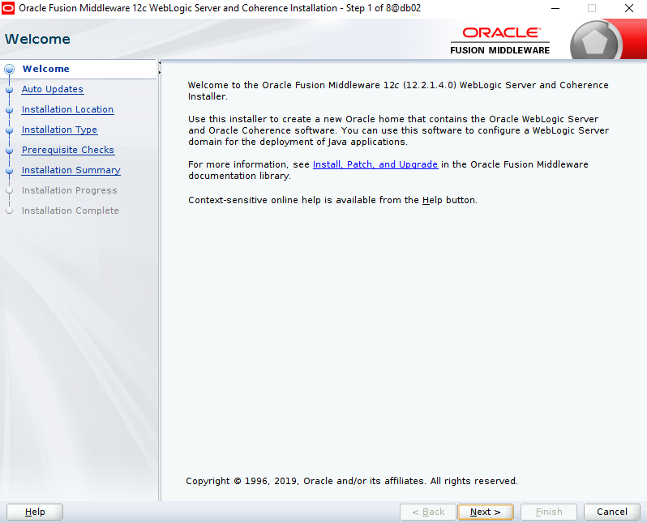


2. Auto Updates:
    - [✔] Skip Auto Updates
    - Click Next 

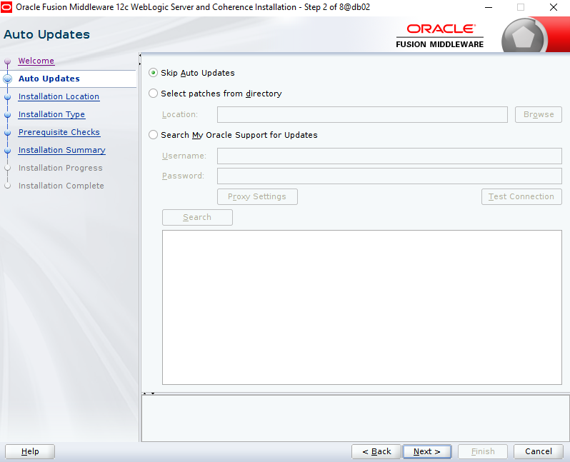


3. Installation Location:
    - Oracle Home: `/u01/app/oracle/product/12.2.1`
	- Click Next

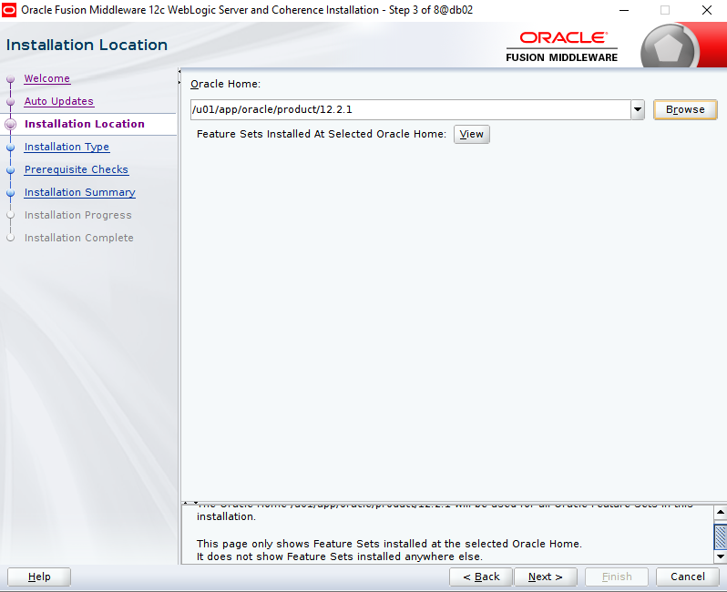


4. Installation Type:
    - [✔] Weblogic Server
	- Click Next

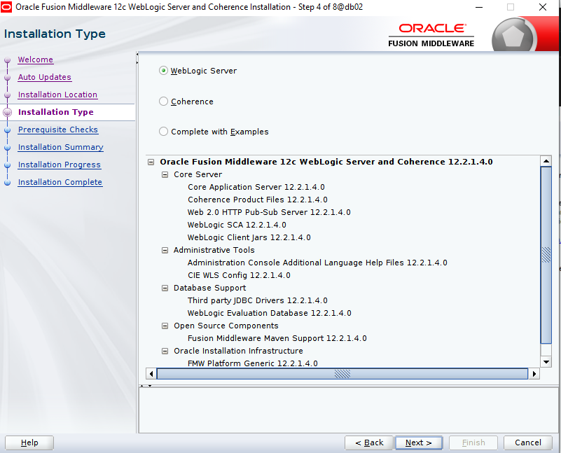


5. Prerequisite Checks:
    - Click Next

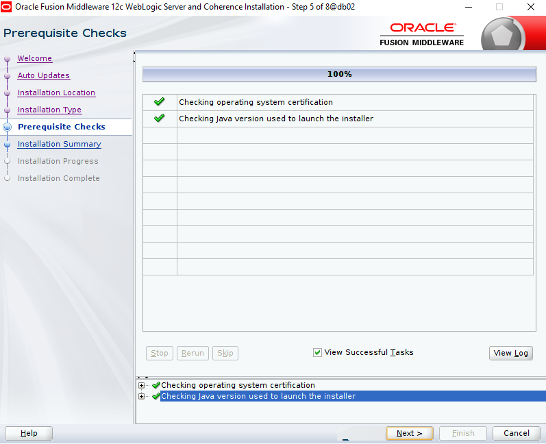


6. Installation Summary:
    - Click Install

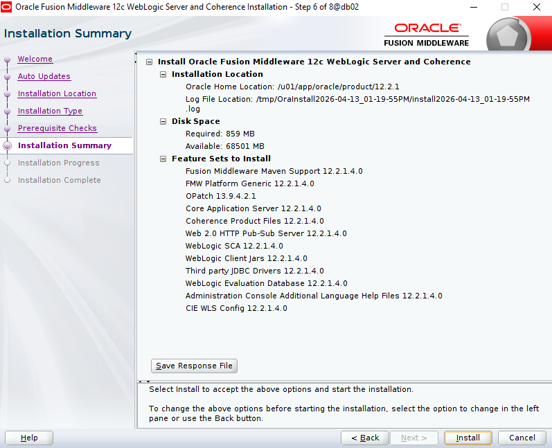


7. Installation Progress:
    - Click Next

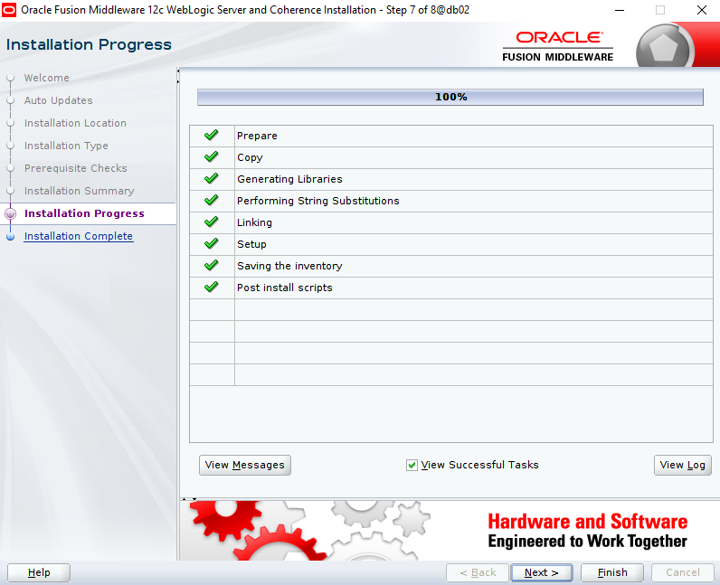


8. Installation Complete:
    - [ ] Automatically Launch the configuration wizard [-> Or, Un-check it]
	- Click Finish

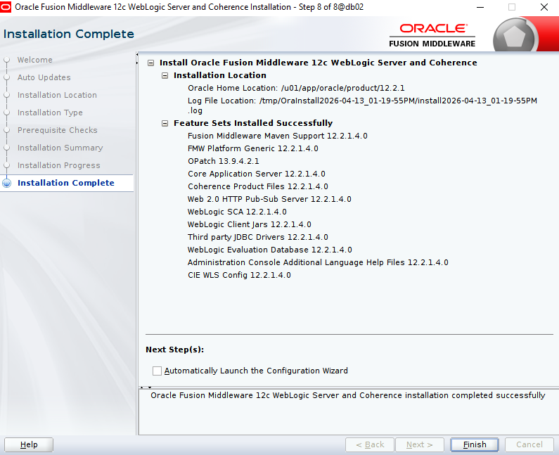


### Configure WebLogic Domain Server:


```
ll /u01/app/oracle/product/12.2.1/oracle_common/common/bin/

cd /u01/app/oracle/product/12.2.1/oracle_common/common/bin/
```


```
./config.sh
```


1. Create Domain: 
	- [✔] Create a new domain
	- Domain Location: `/u01/app/oracle/config/domains/adminDomain`
	- Click Next 

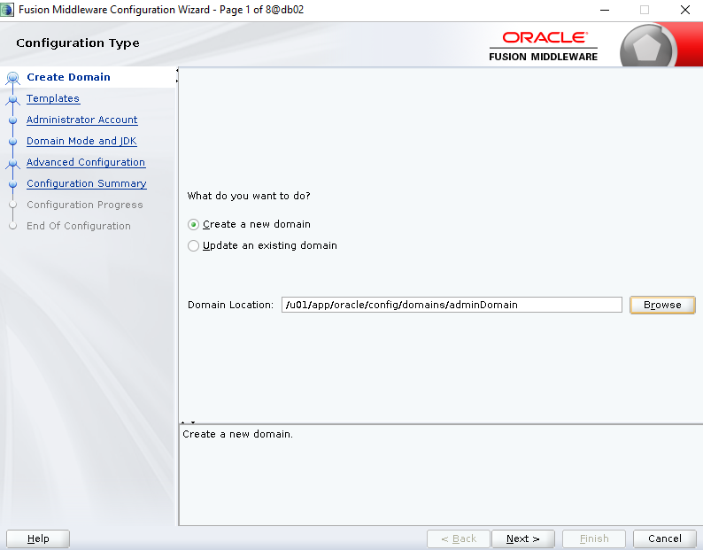


2. Templates:
	- [✔] Create Domain using Product Templates:
    - Available Templates:
	    - [✔] Basic Weblogic Server Domain [wlserver]*
	- Click Next

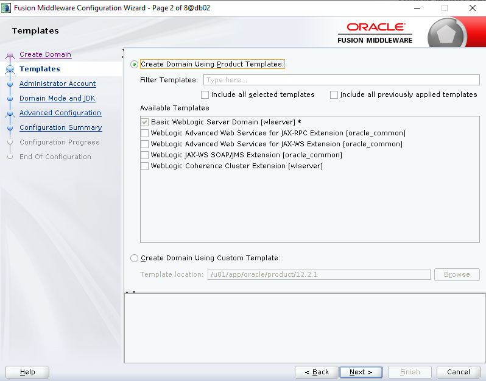


3. Administrator Account:
	- Name: `wladmin`
	- Password: admin123
	- Confirm password: admin123
	- Click Next

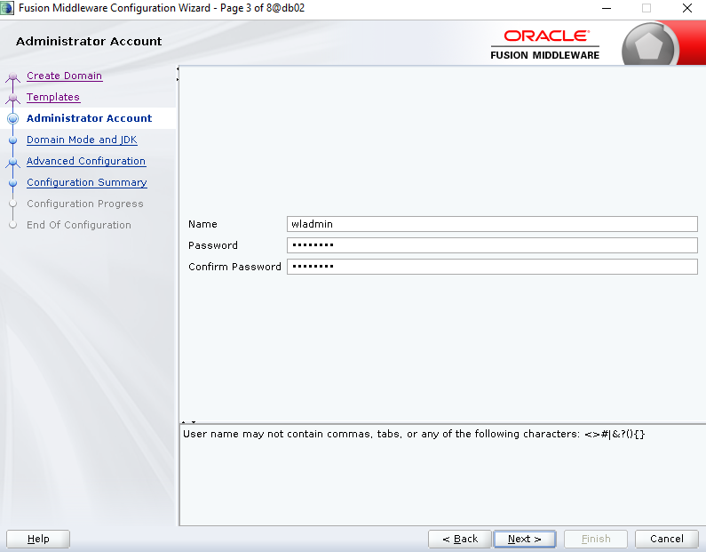


4. Domain Mode and JDK:
	- Domain Mode
		- [✔] Production
	- JDK:
		- [✔] Oracle HotSpot 1.8.0_201 /opt/jdk/jdk1.8.0_201
	- Click Next

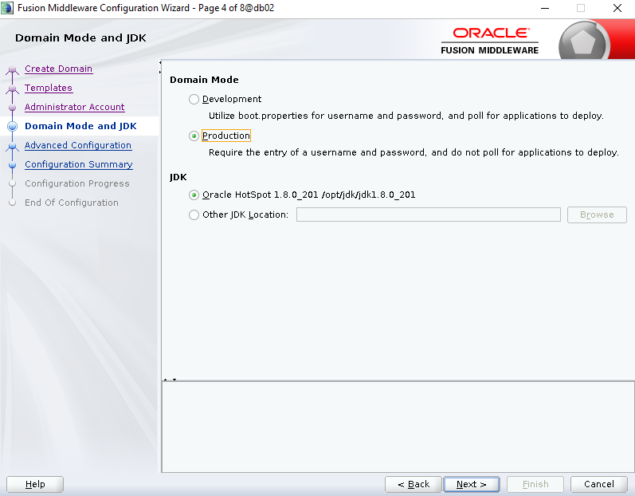


5. Advanced Configuration: 	[`Note`: If **Admin Server/Domain** node select all]
	- [✔] Administrator Server
	- [ ] Node Manager
	- [ ] Topology			[--> **For cluster**]
	- Click Next

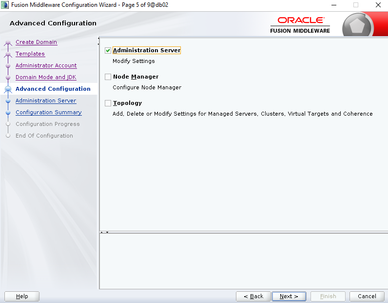


6. Administration Server:
	- Server Name: AdminServer
	- Listen Address: `10.1.1.11` Or `All local addresses`
	- Listen Port: `7001`
	- Click Next


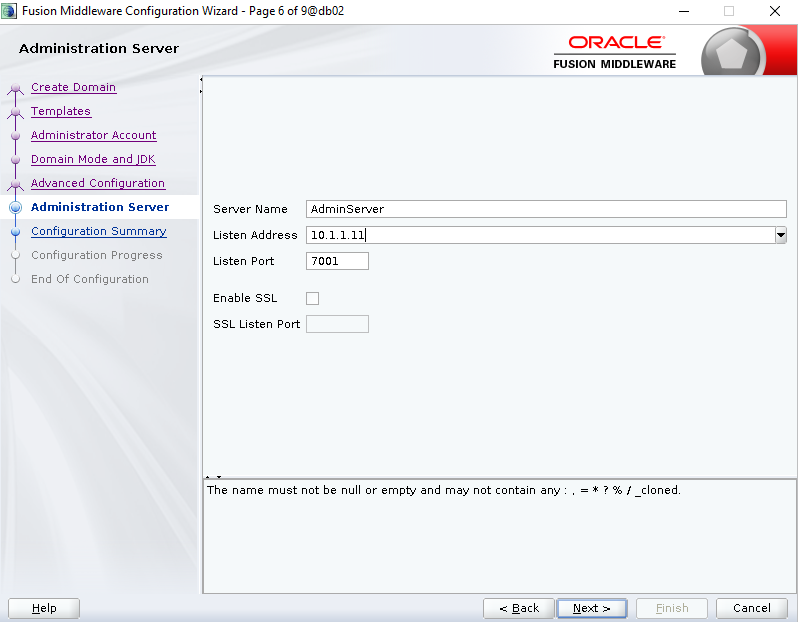


7. Configuration summary:
	- Create

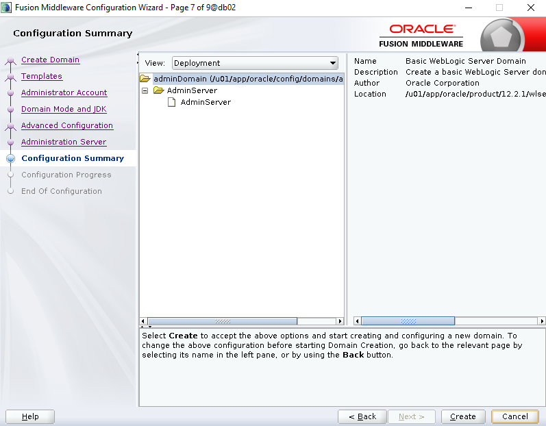


8. Configuration Progress:
	- Click Next

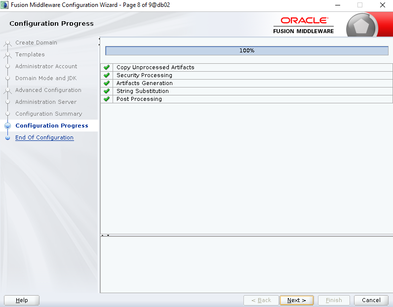


9. End of Configuration:
	- Finish 

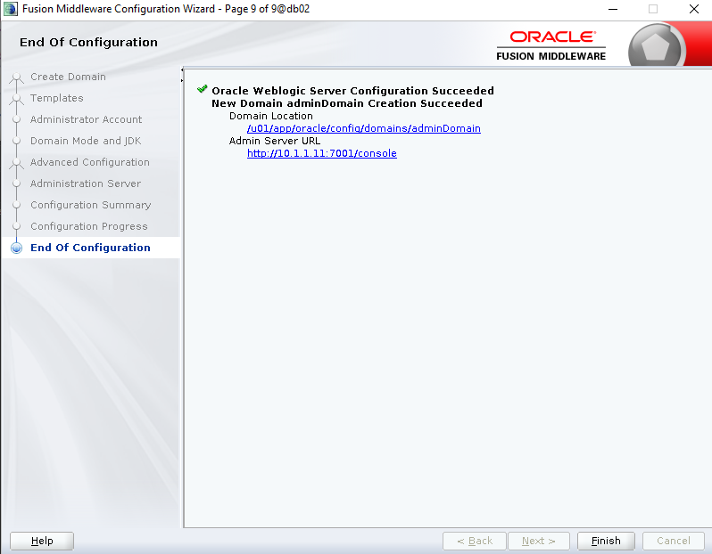


### Start Admin Server:

```
echo $DOMAIN_HOME

/u01/app/oracle/config/domains/adminDomain
```


```
cd /u01/app/oracle/config/domains/adminDomain
```


#### Start Method-1:  (With Password Start)

```
./startWebLogic.sh


### Console:
Enter username to boot WebLogic server: wladmin
Enter password to boot WebLogic server: admin123
```


#### Start Method-2: (Without Password Start)

```
ll $DOMAIN_HOME/servers/<your_weblogic_server_name>

mkdir -p $DOMAIN_HOME/servers/<your_weblogic_server_name>/security

mkdir -p $DOMAIN_HOME/servers/AdminServer/security
cd $DOMAIN_HOME/servers/AdminServer/security
```


```
echo "username=wladmin" > $DOMAIN_HOME/servers/AdminServer/security/boot.properties

echo "password=admin123" >> $DOMAIN_HOME/servers/AdminServer/security/boot.properties
```


```
cd $DOMAIN_HOME
```


```
./startWebLogic.sh
```


```
netstat -tlpn | grep 7001

tcp6     0      0 10.1.1.11:7001      :::*    LISTEN      709918/java
```


### Access WebLogic Console:

_Open Browser:_
```
http://<server-ip>:7001/console
```


### Ref: 
- [WebLogic Server 12cR2](https://oracle-base.com/articles/12c/weblogic-installation-on-oracle-linux-6-and-7-1221)
- [Weblogic Server 12c](https://centlinux.com/install-oracle-weblogic-server-12c/)

